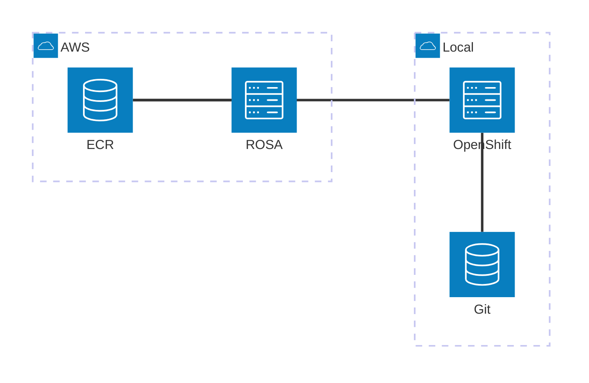

# README

## オリジナルのコンテンツ
https://github.com/RH-OPEN/ocp-handson
https://rh-open.github.io/ocp-handson/openshift-services/index.html

## コンテンツの生成
antora --stacktrace antora-playbook.yml

## ワークショップガイド

ワークショップのコンテンツを動的に変化させるため、以下の値をクエリパラメータに設定する。
USERIDはユーザが設定
SUBDOMAINは、`console-openshift-console.apps.rosa.rosa-abcde.zs4d.p3.openshiftapps.com` の場合は `rosa-abcde.zs4d.p3.openshiftapps.com`
AWSACCOUNTIDは、AWSのアカウントIDを指定する。

https://akubicharm.github.io/rh-workshop-rosa/akubi-project/index.html?USERID=&SUBDOMAIN=rosa-xxxx.yyyy.zz.openshiftapps.com&AWSACCOUNTID=123412341234

## ワークショップ環境


このワークショップは開発環境としてROSA、プロダクション環境としてオンプレのOpenShiftの利用を想定しています。
開発環境で作成されたコンテナイメージはECRを経由して、プロダクション環境へ納品されます。



## ECR へのアクセス設定

### IAM ユーザ作成


### ECR権限設定
ECRへのアクセス権限の設定。本来は細々と権限を設定するべきだと思いますが、ひとまず * で設定します。


```json
{
    "Sid": "user01-statement",
    "Effect": "Allow",
    "Principal": {
        "AWS": "arn:aws:iam::[AWS ACCOUNT ID]:user/user01"
    },
    "Action": "ecr:*",
    "Resource": "arn:aws:ecr:us-east-2:[AWS ACCOUNT ID]:repository/*"
}
```