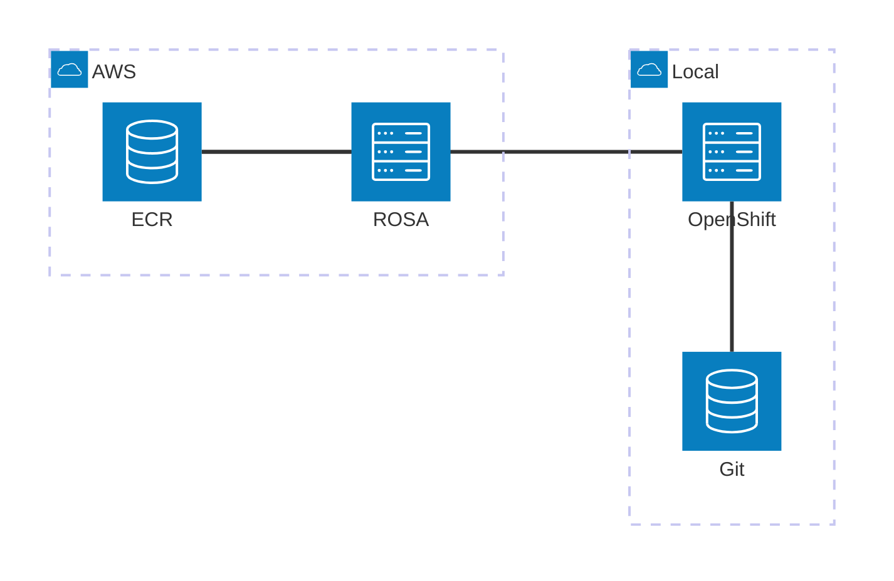

# README

## オリジナルのコンテンツ
https://github.com/RH-OPEN/ocp-handson
https://rh-open.github.io/ocp-handson/openshift-services/index.html

## コンテンツの生成
antora --stacktrace antora-playbook.yml

## ワークショップガイド

ワークショップのコンテンツを動的に変化させるため、以下の値をクエリパラメータに設定する。
USERIDはユーザが設定
SUBDOMAINは、`console-openshift-console.apps.rosa.rosa-abcde.zs4d.p3.openshiftapps.com` の場合は `rosa-abcde.zs4d.p3.openshiftapps.com`
AWSACCOUNTIDは、AWSのアカウントIDを指定する。

https://akubicharm.github.io/rh-workshop-rosa/akubi-project/index.html?USERID=&SUBDOMAIN=rosa-xxxx.yyyy.zz.openshiftapps.com&AWSACCOUNTID=123412341234

## ワークショップ環境


このワークショップは開発環境としてROSA、プロダクション環境としてオンプレのOpenShiftの利用を想定しています。
開発環境で作成されたコンテナイメージはECRを経由して、プロダクション環境へ納品されます。



## ECR へのアクセス設定

### IAM ユーザ作成


### ECR権限設定
ECRへのアクセス権限の設定。本来は細々と権限を設定するべきだと思いますが、ひとまず * で設定します。
```sh
aws iam create-group --group-name labusers
aws iam create-user --user-name user15
aws iam add-user-to-group --user-name user15 --group-name labusers
aws iam create-login-profile --user-name user15 --password OpenShift123!
```

AWSコンソールでlabuser グループに、許可ポリシーで ecr/* を付与

export repo_name='test1/albumui'

 aws ecr create-repository \
   --repository-name 'test1/albumui' \
   --image-scanning-configuration scanOnPush=true \
   --region us-east-2

{
   "Sid": "test1-statement",
  "Effect": "Allow",
  "Principal": {
    "AWS": "arn:aws:iam::714932348383:user/test1"
  },
  "Action": [
    "ecr:*"
  ],
  "Resource": "arn:aws:ecr:us-east-2:714932348383:repository/*"
}   

ユーザごとに設定する時
```json
{
    "Sid": "user1-statement",
    "Effect": "Allow",
    "Principal": {
        "AWS": "arn:aws:iam::[AWS ACCOUNT ID]:user/user1",
    },
    "Action": "ecr:*"
}
```


ロギング用の準備
manifest/openshift/secret-for-logging.yaml でシークレットを作成 
AWSコンソールで利用するS3 Bucketを開き、プロパティで
ARNを確認

arn:aws:iam::xxxxx:role/rosa-hcp-s3-role


## ラボ用　cluster-admin 権限を持つユーザの作成

```
 for i in {1..15}; do htpasswd -bB admin.htpasswd admin$i openshift; done
rosa create idp --type=htpasswd --name=lab-cluster-admin --cluster=keomizorosa --from-file=admin.htpasswd

oc apply -f manifest/openshift/admin.yaml
```
